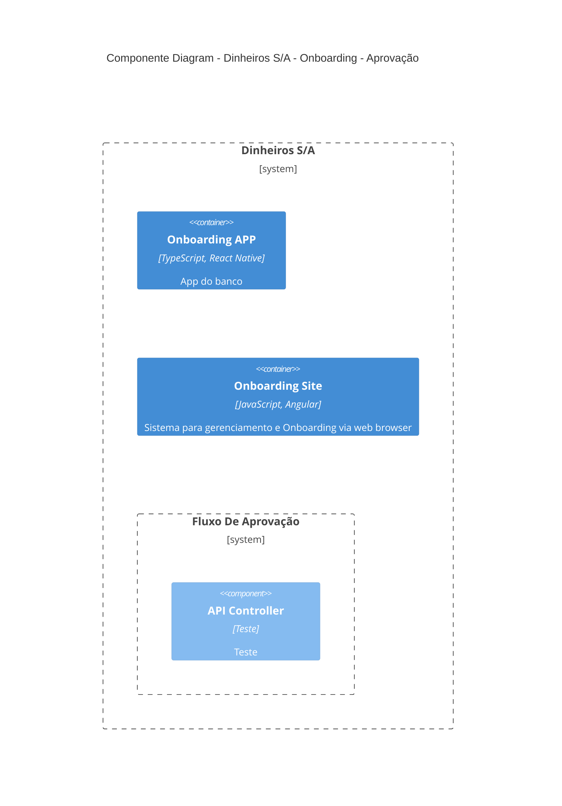

# Componente

```mermaid
C4Context
  title Componente Diagram - Dinheiros S/A - Onboarding - Aprovação

  Boundary(banco,"Dinheiros S/A") {
      Container(app_mobile, "Onboarding APP", "TypeScript, React Native", "App do banco")
      Container(app, "Onboarding Site", "JavaScript, Angular", "Sistema para gerenciamento e Onboarding via web browser")

      Boundary(aprovacao, "Fluxo De Aprovação"){
          Component(controller, "API Controller", "Teste", "Teste")
      }
  }

```