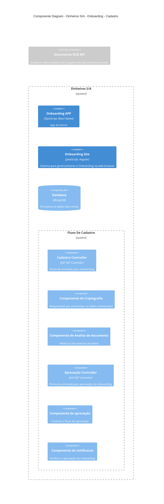

# Componente

```mermaid
C4Context
  title Componente Diagram - Dinheiros S/A - Onboarding - Cadastro

  Boundary(banco,"Dinheiros S/A") {
      Container(app_mobile, "Onboarding APP", "TypeScript, React Native", "App do banco")
      Container(app, "Onboarding Site", "JavaScript, Angular", "Sistema para gerenciamento e Onboarding via web browser")

      Boundary(aprovacao_boundary, "Fluxo De Cadastro"){
          Component(controller, "Cadastro Controller", "ASP NET Controller", "Ponto de entreada para onboarding")
          Component(criptografia, "Componente de Criptografia", "", "Responsável por anonimizar os dados cadastrados")
          Component(analise, "Componente de Analise de documento", "", "Valida os documentos enviados")

          Component(controller_aprovacao, "Aprovação Controller", "ASP NET Controller", "Ponto de entreada para aprovação do onboarding")
          Component(aprovacao, "Componente de aprovação", "", "Controla o fluxo de aprovação")
          Component(notificacao, "Componente de notificacao", "", "Notificar a aprovação do onboarding")
      }

      ComponentDb(mongodb, "Database", "MongoDB", "Armazena os dados das contas")
  }

  Component_Ext(documentos, "Documento OCR API", "", "Analisa e retorna dados das imagens dos documentos enviado")
```