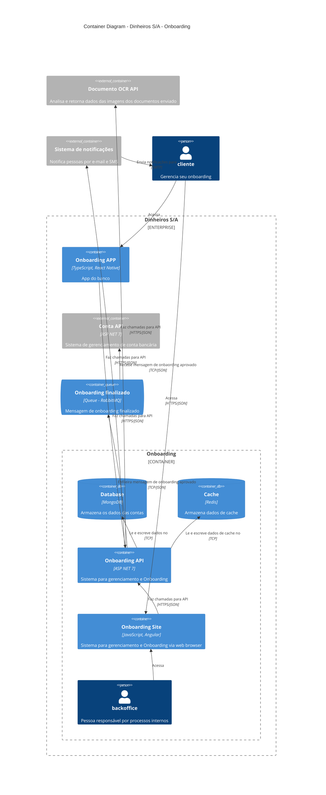

# Container

```mermaid
C4Context
    title Container Diagram - Dinheiros S/A - Onboarding
    
    Enterprise_Boundary(banco,"Dinheiros S/A") {
        Container_Boundary(banco_onboarding,"Onboarding") {        
            ContainerDb(mongodb, "Database", "MongoDB", "Armazena os dados das contas")
            ContainerDb(redis, "Cache", "Redis", "Armazena dados de cache")

            Container(api, "Onboarding API", "ASP NET 7", "Sistema para gerenciamento e Onboarding")
            Container(app, "Onboarding Site", "JavaScript, Angular", "Sistema para gerenciamento e Onboarding via web browser")
            Person(backoffice, "backoffice", "Pessoa responsável por processos internos")
        }
        Container(app_mobile, "Onboarding APP", "TypeScript, React Native", "App do banco")

        Container_Ext(api_conta, "Conta API", "ASP NET 7", "Sistema de  gerenciamento de conta bancária")
        ContainerQueue(queue_conta, "Onboarding finalizado", "Queue - RabbitMQ", "Mensagem de onboarding finalizado")
    }

    Container_Ext(documentos, "Documento OCR API", "", "Analisa e retorna dados das imagens dos documentos enviado")
    Container_Ext(notifications, "Sistema de notificações", "", "Notifica pessoas por e-mail e SMS")

    Person(cliente, "cliente", "Gerencia seu onboarding")

    Rel(api, mongodb, "Le e escreve dados no", "TCP")
    Rel(api, redis, "Le e escreve dados de cache no", "TCP")

    Rel(cliente, app, "Acessa", "HTTPS/JSON")
    Rel(cliente, app_mobile, "Acessa", "")

    Rel(backoffice, app, "Acessa", "")

    Rel(app, api, "Faz chamadas para API", "HTTPS/JSON")
    Rel(app_mobile, api, "Faz chamadas para API", "HTTPS/JSON")

    Rel(api, documentos, "Faz chamadas para API", "HTTPS/JSON")
    Rel(api, notifications,"Faz chamadas para API", "HTTPS/JSON")
    Rel(api, queue_conta, "Enfileira mensagem de onboarding aprovado", "TCP/JSON")

    Rel(queue_conta, api_conta, "Recebe mensagem de onbaording aprovado", "TCP/JSON")


    Rel(notifications, cliente, "Envia notificações para", "SMTP")
```