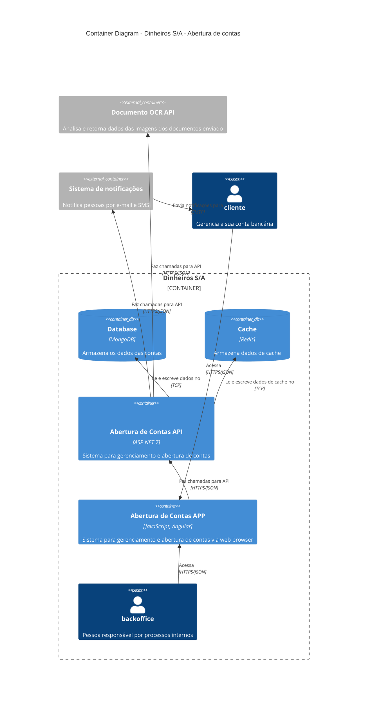

# Container

```mermaid
C4Context
    title Container Diagram - Dinheiros S/A - Abertura de contas

    Container_Boundary(banco,"Dinheiros S/A") {        
        ContainerDb(mongodb, "Database", "MongoDB", "Armazena os dados das contas")
        ContainerDb(redis, "Cache", "Redis", "Armazena dados de cache")

        Container(api, "Abertura de Contas API", "ASP NET 7", "Sistema para gerenciamento e abertura de contas", "API")
        Container(app, "Abertura de Contas APP", "JavaScript, Angular", "Sistema para gerenciamento e abertura de contas via web browser")

        Person(backoffice, "backoffice", "Pessoa responsável por processos internos")
    }

    Container_Ext(documentos, "Documento OCR API", "", "Analisa e retorna dados das imagens dos documentos enviado")
    Container_Ext(notifications, "Sistema de notificações", "", "Notifica pessoas por e-mail e SMS")

    Person(cliente, "cliente", "Gerencia a sua conta bancária")

    Rel(api, mongodb, "Le e escreve dados no", "TCP")
    Rel(api, redis, "Le e escreve dados de cache no", "TCP")

    Rel(cliente, app, "Acessa", "HTTPS/JSON")
    Rel(backoffice, app, "Acessa", "HTTPS/JSON")
    Rel(app, api, "Faz chamadas para API", "HTTPS/JSON")
    Rel(api, documentos, "Faz chamadas para API", "HTTPS/JSON")
    Rel(api, notifications,"Faz chamadas para API", "HTTPS/JSON")
    Rel(notifications, cliente, "Envia notificações para", "SMTP")
```