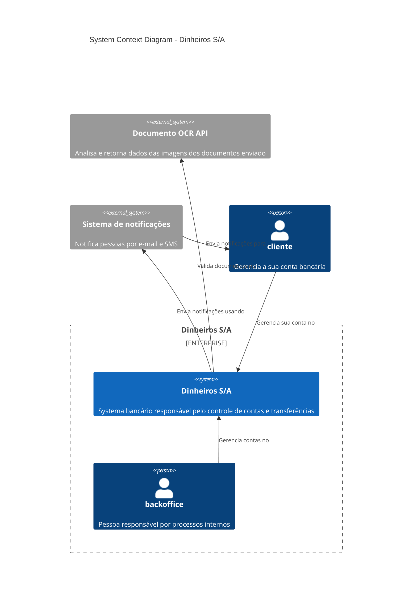

# System Context

```mermaid
C4Context
    title System Context Diagram - Dinheiros S/A

    Enterprise_Boundary(banco,"Dinheiros S/A") {
      System(dinheiros, "Dinheiros S/A", "Systema bancário responsável pelo controle de contas e transferências")
      Person(backoffice, "backoffice", "Pessoa responsável por processos internos")
    }

    System_Ext(documentos, "Documento OCR API", "Analisa e retorna dados das imagens dos documentos enviado")
    System_Ext(notifications, "Sistema de notificações", "Notifica pessoas por e-mail e SMS")

    Person(cliente, "cliente", "Gerencia a sua conta bancária")

    Rel(cliente, dinheiros, "Gerencia sua conta no")
    Rel(backoffice, dinheiros, "Gerencia contas no")
    Rel(dinheiros, documentos, "Valida documentos no")
    Rel(dinheiros, notifications, "Envia notificações usando")
    Rel(notifications, cliente, "Envia notificações para")

```