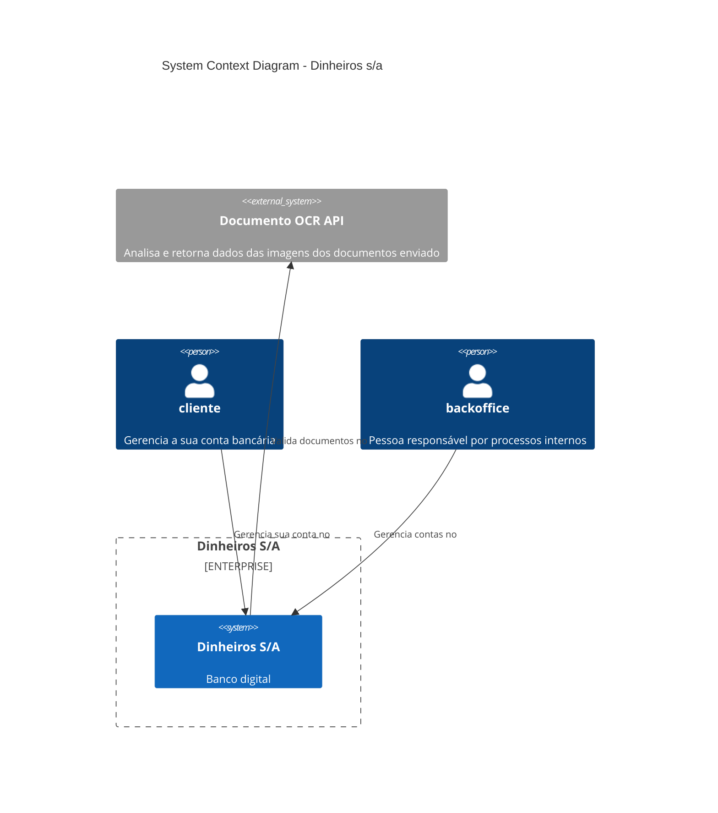

# System Context

```mermaid
C4Context
    title System Context Diagram - Dinheiros s/a

    Enterprise_Boundary(banco,"Dinheiros S/A") {
      System(dinheiros, "Dinheiros S/A", "Banco digital")
    }

    System_Ext(documentos, "Documento OCR API", "Analisa e retorna dados das imagens dos documentos enviado")
    Person(cliente, "cliente", "Gerencia a sua conta bancária")
    Person(backoffice, "backoffice", "Pessoa responsável por processos internos")

    Rel(cliente, dinheiros, "Gerencia sua conta no")
    Rel(backoffice, dinheiros, "Gerencia contas no")
    Rel(dinheiros, documentos, "Valida documentos no")

```