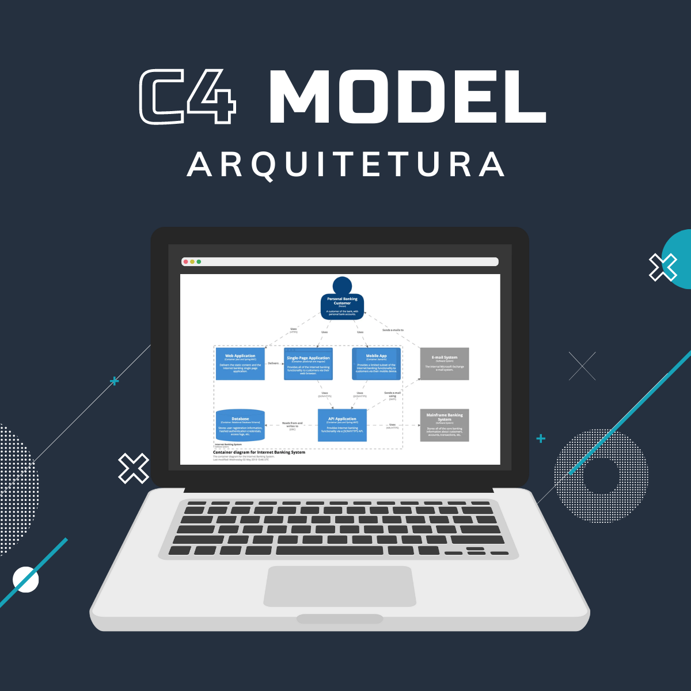

# C4-Model

Palestra e conteúdos sobre C4 Model

## 🚀 C4 Model - Arquitetura de Software 📐

O C4 Model é uma abordagem simples e intuitiva que permite visualizar a arquitetura de um sistema de software em diferentes níveis de detalhe, proporcionando uma maneira clara e concisa de comunicar a estrutura do software para as partes interessadas, incluindo desenvolvedores, arquitetos, gerentes de projeto e clientes. 💡
A chave para o sucesso do C4 Model é a sua abordagem de camadas, que divide a arquitetura em quatro níveis principais:

1️⃣ Nível 1: Contexto
Nesse nível, representamos o sistema como um todo, identificando as principais partes interessadas (atores externos) e as interações entre eles. É como ter uma visão aérea do sistema, mostrando como ele se encaixa no ambiente maior.

2️⃣ Nível 2: Contêineres
No nível dos contêineres, detalhamos as principais partes do sistema, como aplicativos, bancos de dados, serviços web, entre outros. Aqui, destacamos as relações entre os contêineres e como eles se comunicam entre si.

3️⃣ Nível 3: Componentes
Agora, mergulhamos nos detalhes internos dos contêineres e identificamos os componentes individuais que os compõem. Podemos pensar em componentes como classes, módulos, bibliotecas ou pacotes.

4️⃣ Nível 4: Código
Por fim, no nível do código, chegamos à implementação real dos componentes. Nessa camada, podemos explorar a estrutura interna dos componentes, como classes, interfaces, funções, etc. Esse pode ser até mesmo o nosso UML que boa parte das pessoas desenvolvedoras estão acostumadas.
