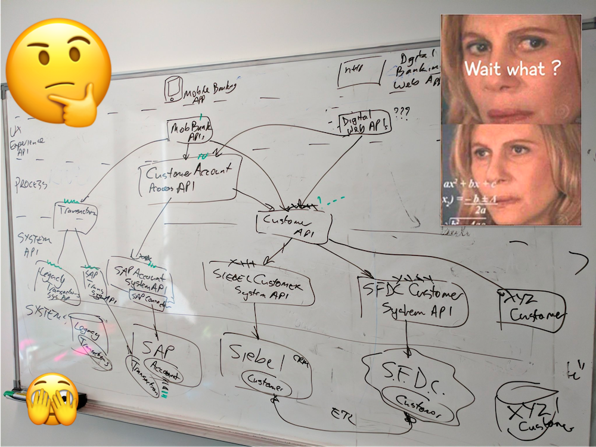
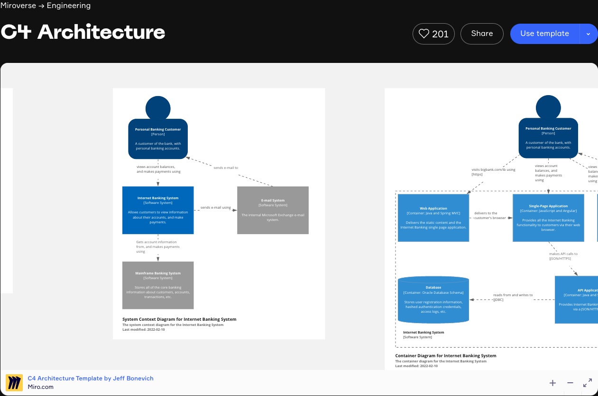

## üöÄ C4 - Model üìê

{ width=55% }

---

### Problema

---

### Padronização!

{ width=60% }

---

### Fluxo, Arquitetura, Cloud...

---

{ width=80% }

---

#### Mesma solução diferentes desenhos

{ width=60% }

---

{ width=90% }

---

### UML?
{ width=30% }

---

### Complexidade
Principalmente na criação, são muitas regras!

---

---

### Camadas

---

### System Context

---

### Container

---

### Component

---

## Code

{ width=60% }

---

### Ferramentas

{ width=70% }

---

### Miro

{ width=85% }

---

### Excalidraw

---

### Como manter atualizado?

{ width=60% }

---

### Diagram As Code

{ width=60% }

---

## Plant UML

{ width=50% }

---

## Mermaid

{ width=40% }

---

### Bora pra pr√°tica!

---

### D√∫vidas?

{ width=90% }